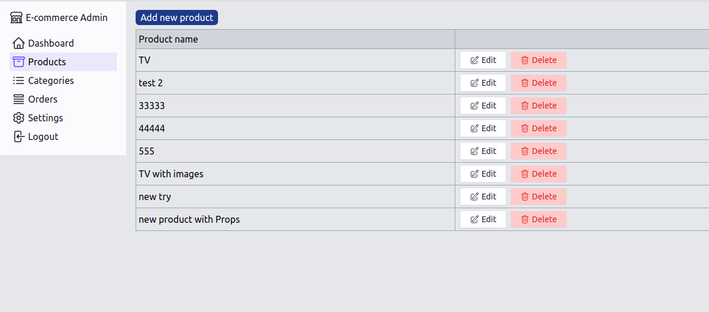
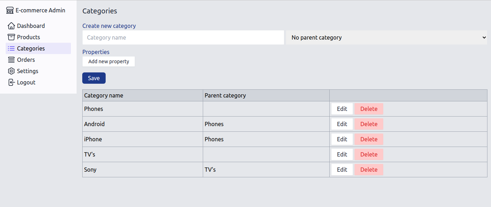
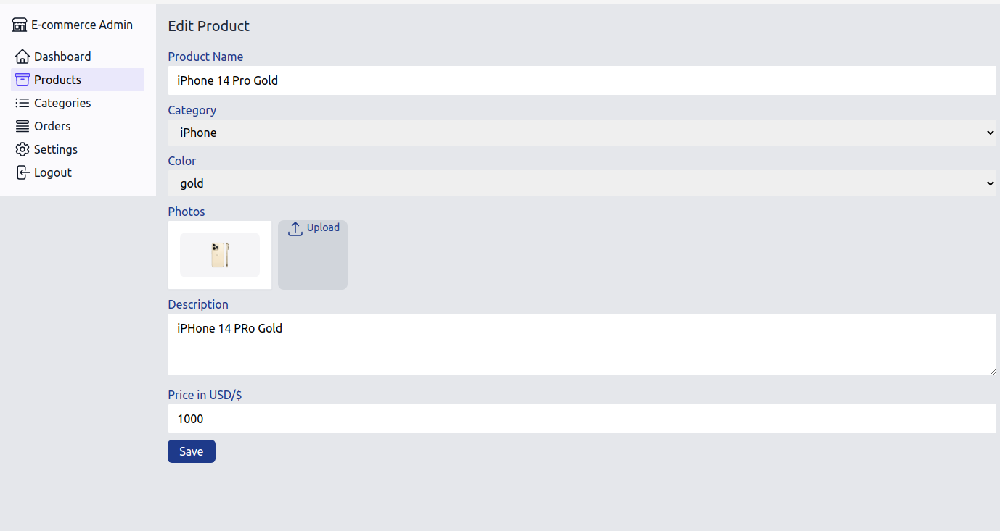
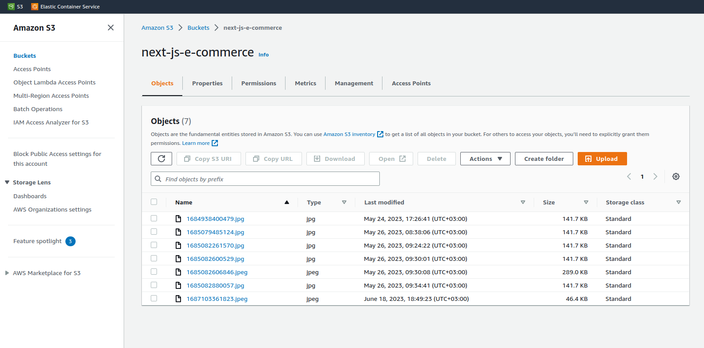
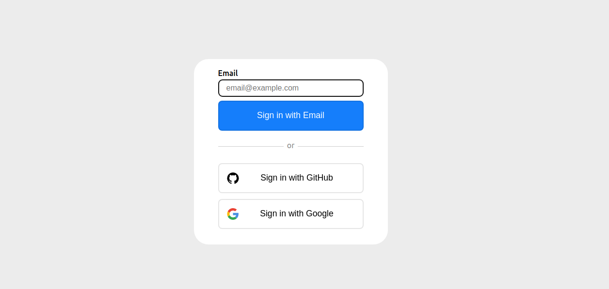
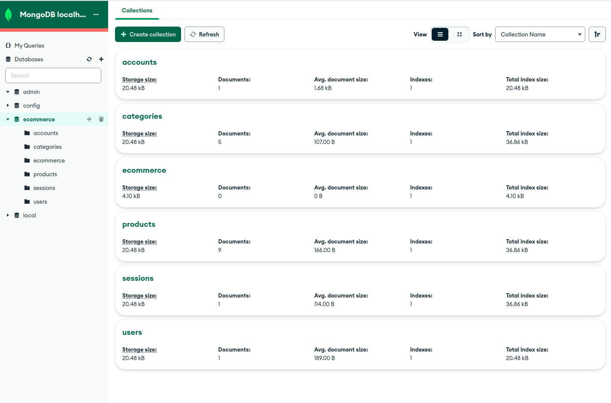

# E-commerce-nextjs
E-commerce back-End with Yarn, NextJS, TailwindCSS, Axios, MongoDB, Mongoose, ASW S3, Stripe's payments and MailHog

## Screenshots

Notice: **UI is still in progress**

Products page: 


Categories page:


Edit product page:



AWS S3 Bucket and images:


Login options with: E-mail, Github Account or Google Account


MongoDB and MongoDB Compass 


# Clone project 
```
git clone https://github.com/sivanov/e-commerce-nextjs.git
cd e-commerce-nextjs
cd backend
```

Install all the dependencies listed within package.json in the local node_modules folder.
> yarn install

# Start from scratch
This section will be used like  tutorial for major steps needed to reproduce this project from scratch

## Creating Api and Admin project

```
mkdir backend
cd backend
npm install --global yarn
yarn create next-app .
```

configuration is:
```sh*
✔ Would you like to use TypeScript with this project? … NO
✔ Would you like to use ESLint with this project? …  Yes
✔ Would you like to use Tailwind CSS with this project? …  Yes
✔ Would you like to use `src/` directory with this project? …  NO
✔ Use App Router (recommended)? … No 
✔ Would you like to customize the default import alias? …  NO
```

run server to test installation
```
pnpm dev
```
now open url: http://localhost:3000